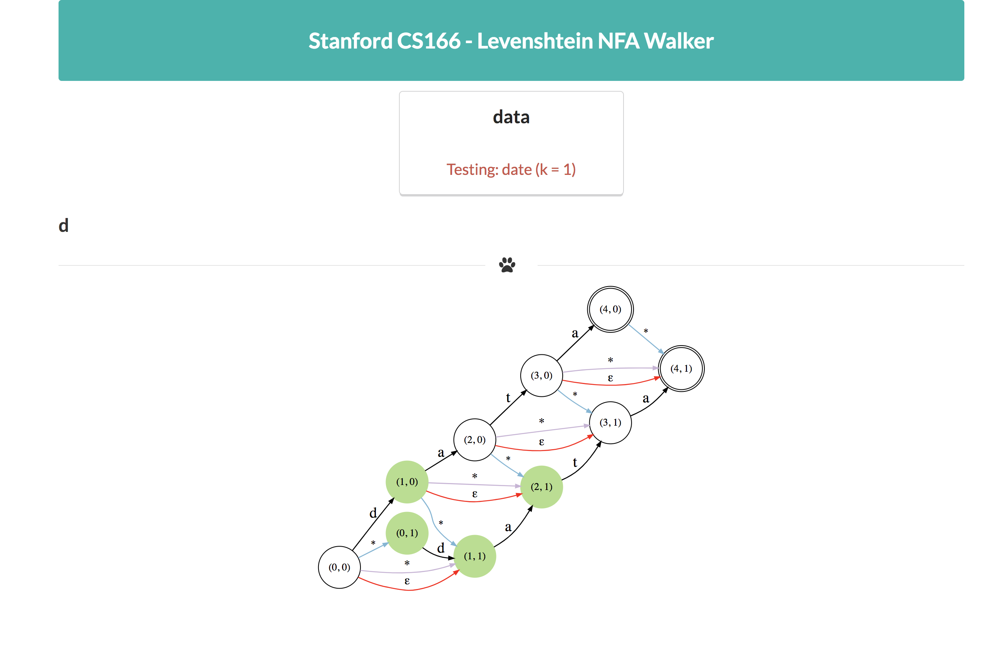
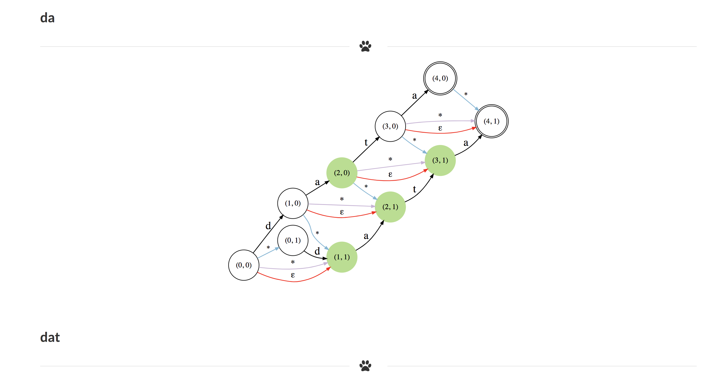
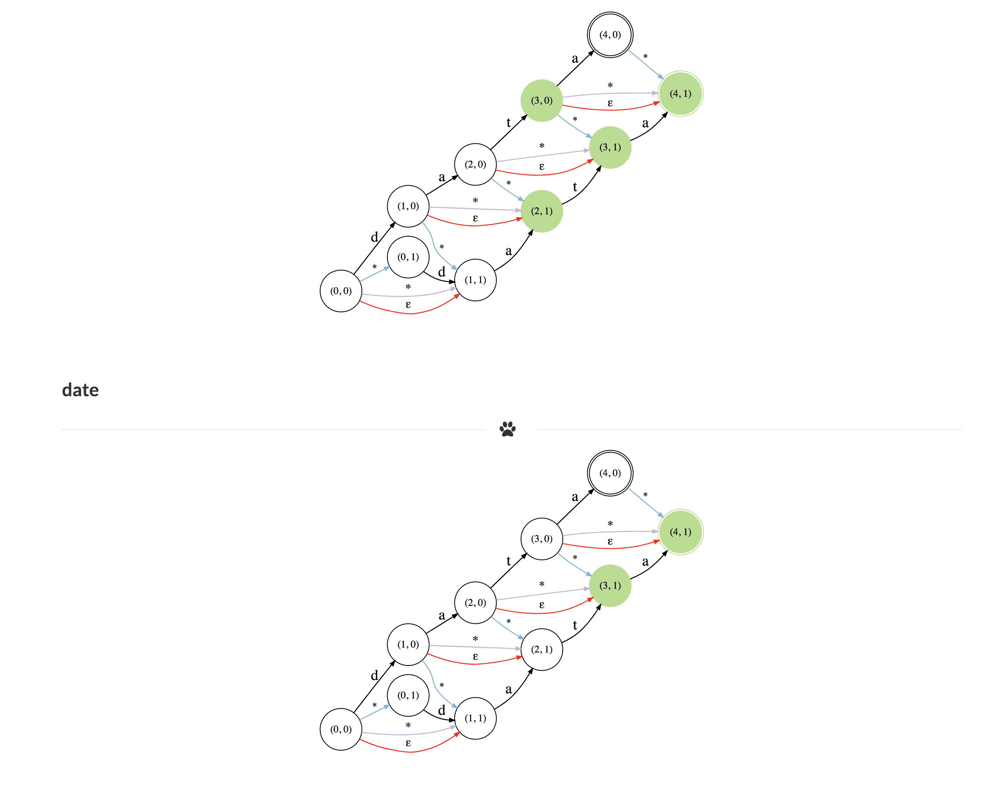
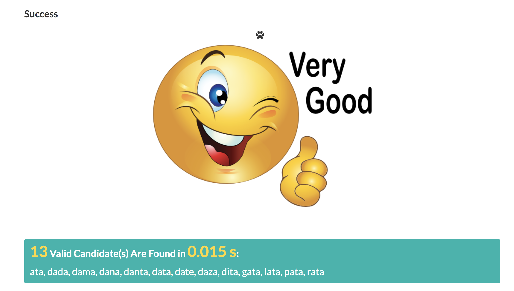

# CS166-Project: Levenshtein Automata

##### 2018 Spring | Stanford

#### Team:
- Baige Liu
- Amy Wang
- Li Deng

#### Explorer

```
dengl11 | demo:./explore.py
Using Corpus:
----------------------
Number of words:     235884
Number of nodes:     758659


Welcome to CS166-Levenshtein Automation Walker !
-------------------------------------------------
Type your word for Levenshtein, test word and max edit distance like: <Levenshtein_Word> <Test_Word> k
Your input:
data date 1
--=-=-=-=-=-=-=-=-=-=-=-=-=-=-=-=-=-=-=-=-=-=-=-=
```  

<div style="text-align:center">




</div>


#### Critique

> Should explore more about practical spell correction practice, like the BK Tree, instead of just comparing with the naive approach

